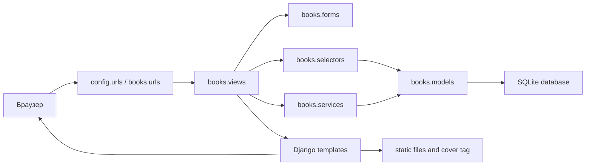

# Особиста книжкова бібліотека

[English](README.md) | Українська

Django-застосунок для ведення каталогу книг і особистої читацької бібліотеки. Він підтримує книги, авторів, ієрархію категорій, записи особистої бібліотеки, прогрес читання, теги, полиці, нотатки, закладки, цитати, рецензії, публічні полиці, публічні рецензії та сесії читання.

Поточний пакет налаштувань Django називається `config`, а основний доменний застосунок - `books`.

## Зміст

- [Огляд](#огляд)
- [Можливості](#можливості)
- [Технологічний стек](#технологічний-стек)
- [Архітектура](#архітектура)
- [Модель даних](#модель-даних)
- [Структура проєкту](#структура-проєкту)
- [Системні вимоги](#системні-вимоги)
- [Швидкий запуск](#швидкий-запуск)
- [Детальне встановлення](#детальне-встановлення)
- [Демонстраційний обліковий запис](#демонстраційний-обліковий-запис)
- [Основні адреси](#основні-адреси)
- [Обкладинки книг і медіафайли](#обкладинки-книг-і-медіафайли)
- [Статичні файли](#статичні-файли)
- [Адміністративна панель](#адміністративна-панель)
- [Тестування](#тестування)
- [Команди розробника](#команди-розробника)
- [Розв'язання типових проблем](#розвязання-типових-проблем)
- [Зауваження щодо production](#зауваження-щодо-production)
- [Безпека](#безпека)
- [Git і локальні файли](#git-і-локальні-файли)
- [Скриншоти](#скриншоти)
- [Ліцензія](#ліцензія)

## Огляд

Це повноцінний Django CRUD-застосунок для особистої книжкової бібліотеки. У ньому є публічний каталог і приватний робочий простір для авторизованих користувачів. Гості можуть переглядати книги, авторів, категорії, публічні полиці та опубліковані рецензії. Авторизовані користувачі можуть вести власну бібліотеку, відстежувати прогрес, писати нотатки й цитати, створювати полиці та публікувати вибрані рецензії або полиці.

Проєкт має шарову структуру:

- `models.py` описує сутності бази даних і валідацію поряд із даними.
- `forms.py` описує Django/crispy-форми та базову валідацію введення.
- `selectors.py` містить SELECT-запити, фільтрацію, анотації та оптимізацію ORM.
- `services.py` містить створення, оновлення, видалення, транзакції, перевірку власника та бізнес-правила.
- `views.py` обробляє HTTP-запити, повідомлення, redirect і render.
- Шаблони в `templates/` і `books/templates/books/` відповідають за HTML.
- Статичні файли в `books/static/books/` містять CSS, JavaScript, іконку сайту та локальні demo-обкладинки.

## Можливості

### Каталог

- Книги з назвою, підзаголовком, авторами, категоріями, ISBN-13, видавництвом, роком, кількістю сторінок, мовою, описом, назвою серії та номером у серії.
- Зв'язки many-to-many для авторів і категорій.
- Ієрархія категорій через `Category.parent`.
- Пошук за назвою, підзаголовком, автором, ISBN, видавництвом і описом.
- Фільтри за категорією, автором, роком видання та мовою.
- Сортування через шар селекторів (selector layer).
- Відображення обкладинок через завантажений файл, валідний зовнішній URL або детерміновану локальну demo-картинку.

### Особиста бібліотека

Кожен користувач може додати книгу до власної бібліотеки з такими полями:

- статус читання: `want_to_read`, `reading`, `paused`, `completed`, `dropped`;
- формат книги: `paper`, `ebook`, `audiobook`, `other`;
- видимість: `private`, `friends`, `public`;
- поточна сторінка та обчислений відсоток прогресу;
- особиста оцінка від 1 до 5;
- ознаки улюбленої книги та власності;
- дати початку й завершення читання.

Для завершених книг прогрес нормалізується до 100%, а поточна сторінка - до кількості сторінок книги.

### Організація читання

- Особисті теги з кольорами.
- Полиці з приватною або публічною видимістю.
- Нотатки з типами `note`, `summary`, `idea`, `question`, `todo`.
- Закладки зі сторінкою або позицією.
- Оригінальні цитати з ознакою улюбленої.
- Рецензії зі станом публікації та ознакою спойлерів.
- Сесії читання з часом початку, часом завершення, діапазоном сторінок і коментарем.
- Дашборд зі статистикою бібліотеки, книгами в процесі читання, останніми книгами, нотатками, цитатами й активністю читання.

### Публічні сторінки

- Публічна сторінка профілю.
- Список і сторінка публічної полиці.
- Список і сторінка опублікованих публічних рецензій.
- Публічні селектори показують лише записи `LibraryEntry` з `visibility="public"` там, де це потрібно.

### Адміністрування

Django Admin реєструє моделі проєкту та містить:

- пошук і фільтри;
- autocomplete-поля для пов'язаних об'єктів;
- inline-редагування тегів запису бібліотеки та книг на полицях;
- мініатюри й попередній перегляд обкладинок;
- додаткові колонки зі статистикою та читацькими метаданими.

## Технологічний стек

| Технологія | Версія або налаштування | Призначення |
|---|---:|---|
| Python | Версія, яку підтримує Django 5.2 | Середовище виконання |
| Django | `>=5.2,<6.0` | Вебфреймворк, ORM, auth, admin, templates |
| SQLite | За замовчуванням у `config/settings.py` | Локальна база даних |
| PostgreSQL backend | Додатковий alias при `BOOKS_ENABLE_POSTGRES=1` | Опційний alias бази даних |
| django-crispy-forms | `>=2.3` | Допоміжний шар для форм |
| crispy-bootstrap5 | `>=2024.2` | Bootstrap 5 template pack для crispy |
| django-debug-toolbar | `>=4.0` | Локальна debug-панель |
| Bootstrap 5 | CDN у шаблонах | Стилі інтерфейсу |
| Bootstrap Icons | CDN у шаблонах | Іконки інтерфейсу |
| Pillow | `>=12.2.0` | Потрібен для `ImageField` |
| Selenium | `>=4.6.0` | Залежність для browser/e2e тестування |
| coverage | `>=7.0` | Інструмент для coverage |
| pytest / pytest-django | `>=7.0` / `>=4.5` | Опційний pytest-інструментарій |

Поточні тести в репозиторії написані як Django `TestCase` і запускаються через `python manage.py test`.

## Архітектура



| Шар | Відповідальність |
|---|---|
| `models.py` | Схема бази даних, зв'язки, constraints, модельна валідація, допоміжні властивості. |
| `forms.py` | Поля форм, widgets, crispy-layouts і первинна валідація введення користувача. |
| `selectors.py` | Read-запити, фільтри, annotations, правила публічної/приватної видимості, `select_related` і `prefetch_related`. |
| `services.py` | Мутації, транзакції, перевірка власника, бізнес-правила та підтримка узгодженості даних. |
| `views.py` | HTTP-рівень, обробка форм, повідомлення, redirect, пагінація і render. |
| `urls.py` | Імена маршрутів і відповідність URL до view-функцій. |
| `templates/` | Базовий layout, dashboard-layout, auth-шаблони й спільні layout-компоненти. |
| `books/templates/books/` | Шаблони книг, бібліотеки, полиць, тегів, нотаток, закладок, цитат, рецензій і сесій. |
| `books/static/books/` | CSS, JavaScript, іконка сайту та локальні demo-обкладинки. |
| `books/management/commands/` | Management commands, зокрема наповнення demo data. |
| `admin.py` | Налаштування Django Admin для всіх доменних моделей. |

## Модель даних

| Модель | Призначення |
|---|---|
| `UserProfile` | Додаткова інформація користувача: display name, avatar URL, timezone і bio. |
| `Author` | Автори книг із біографією та опційним сайтом. |
| `Category` | Глобальне дерево категорій зі slug і необов'язковим parent. |
| `Book` | Запис каталогу з метаданими, авторами, категоріями, файлом обкладинки, зовнішнім URL обкладинки та серією. |
| `PersonalTag` | Особисті кольорові теги користувача. |
| `LibraryEntry` | Книга в бібліотеці користувача: статус, прогрес, формат, видимість, оцінка, favorite, owned і дати читання. |
| `LibraryEntryTag` | Проміжна модель між записом бібліотеки та особистим тегом. |
| `Shelf` | Користувацька добірка записів бібліотеки, приватна або публічна. |
| `ShelfItem` | Проміжна модель між полицею та записом бібліотеки. |
| `BookNote` | Типізована особиста нотатка до запису бібліотеки. |
| `Bookmark` | Закладка зі сторінкою або позицією. |
| `Quote` | Збережена цитата та коментар до запису бібліотеки. |
| `Review` | Одна рецензія на запис бібліотеки, з публікацією та spoiler-прапорцем. |
| `ReadingSession` | Лог читання з часом, діапазоном сторінок і нотаткою. |

## Структура проєкту

```text
book_project/
├── manage.py
├── requirements.txt
├── .env.example
├── config/
│   ├── settings.py
│   ├── urls.py
│   ├── asgi.py
│   └── wsgi.py
├── books/
│   ├── admin.py
│   ├── apps.py
│   ├── forms.py
│   ├── models.py
│   ├── selectors.py
│   ├── services.py
│   ├── urls.py
│   ├── views.py
│   ├── management/commands/seed_demo_data.py
│   ├── migrations/
│   ├── static/books/
│   ├── templates/books/
│   ├── templatetags/book_extras.py
│   └── tests/
├── templates/
│   ├── base.html
│   ├── layouts/
│   └── registration/
├── static/
├── staticfiles/
├── media/
└── db.sqlite3
```

`db.sqlite3`, `staticfiles/` і `media/` є локальними runtime-файлами та не мають потрапляти в commit.

## Системні вимоги

- Python, який підтримує Django 5.2.
- `pip`.
- Віртуальне середовище.
- Залежності з `requirements.txt`.
- SQLite достатньо для локальної розробки.
- Pillow має бути встановлений, бо `Book.cover_image` є `ImageField`.

## Швидкий запуск

```bash
cd \book_project
python -m venv .venv
.\.venv\Scripts\Activate.ps1
python -m pip install --upgrade pip
python -m pip install -r requirements.txt
python manage.py migrate
python manage.py seed_demo_data --reset
python manage.py runserver
```

Відкрий:

- `http://127.0.0.1:8000/` для каталогу.
- `http://127.0.0.1:8000/accounts/login/` для входу.
- `http://127.0.0.1:8000/admin/` для Django Admin.

## Детальне встановлення

### Клонування або відкриття проєкту

Відкрий термінал у директорії проєкту:

```bash
cd C:\Users\victo\PycharmProjects\book_project
```

### Створення віртуального середовища

```bash
python -m venv .venv
```

### Активація віртуального середовища

PowerShell:

```powershell
.\.venv\Scripts\Activate.ps1
```

Command Prompt:

```bat
.venv\Scripts\activate.bat
```

macOS/Linux:

```bash
source .venv/bin/activate
```

### Встановлення залежностей

```bash
python -m pip install --upgrade pip
python -m pip install -r requirements.txt
```

### Налаштування середовища

Поточний `settings.py` не завантажує `.env` автоматично. Файл `.env.example` документує опційні environment variables, які читає `config/settings.py`.

Для стандартного SQLite-запуску змінні середовища не потрібні.

Опційний PostgreSQL alias:

```powershell
$env:BOOKS_ENABLE_POSTGRES = "1"
$env:POSTGRES_DB = "books"
$env:POSTGRES_USER = "postgres"
$env:POSTGRES_PASSWORD = "change_me"
$env:POSTGRES_HOST = "127.0.0.1"
$env:POSTGRES_PORT = "5432"
```

Це створює додатковий database alias `postgres`. База `default` залишається SQLite, якщо додатково не змінити налаштування.

### Застосування міграцій

```bash
python manage.py migrate
```

### Завантаження демонстраційних даних

```bash
python manage.py seed_demo_data --reset
```

Доступні варіанти:

```bash
python manage.py seed_demo_data
python manage.py seed_demo_data --reset
python manage.py seed_demo_data --force
```

- `seed_demo_data` створює або оновлює demo records.
- `--reset` видаляє лише demo data, створені цією командою, і створює їх заново.
- `--force` дозволяє запуск при `DEBUG=False`.

Команда ідемпотентна. Повторні запуски не мають створювати дублікати.

### Створення адміністратора

```bash
python manage.py createsuperuser
```

### Запуск сервера

```bash
python manage.py runserver
```

Якщо потрібен інший порт:

```bash
python manage.py runserver 8080
```

## Демонстраційний обліковий запис

Команда demo data створює локального користувача для розробки:

| Поле | Значення |
|---|---|
| Username | `demo_reader` |
| Email | `demo@example.com` |
| Password | `DemoBook123!` |

Цей обліковий запис призначений лише для локального `DEBUG`-середовища. Не використовуй ці credentials у production.

Очікувані кількості demo data:

| Об'єкт | Кількість |
|---|---:|
| Users | 1 |
| Authors | 15 |
| Categories | 23 |
| Books | 36 |
| Library entries | 24 |
| Shelves | 7 |
| Tags | 9 |
| Notes | 24 |
| Bookmarks | 18 |
| Quotes | 20 |
| Reviews | 10 |
| Reading sessions | 42 |

## Основні адреси

| URL | Призначення |
|---|---|
| `/` | Головна сторінка каталогу книг. |
| `/books/` | Список книг із пошуком, фільтрами та сортуванням. |
| `/books/new/` | Створення книги, потрібен login. |
| `/books/<id>/` | Детальна сторінка книги. |
| `/authors/` | Список авторів. |
| `/authors/<id>/` | Детальна сторінка автора. |
| `/categories/` | Дерево категорій. |
| `/categories/<id>/` | Детальна сторінка категорії. |
| `/dashboard/` | Особистий дашборд, потрібен login. |
| `/library/` | Особиста бібліотека, потрібен login. |
| `/tags/` | Особисті теги, потрібен login. |
| `/shelves/` | Особисті полиці, потрібен login. |
| `/public/shelves/` | Список публічних полиць. |
| `/notes/` | Особисті нотатки, потрібен login. |
| `/bookmarks/` | Особисті закладки, потрібен login. |
| `/quotes/` | Особисті цитати, потрібен login. |
| `/reviews/` | Особисті рецензії, потрібен login. |
| `/public/reviews/` | Опубліковані публічні рецензії. |
| `/reading-sessions/` | Сесії читання, потрібен login. |
| `/accounts/login/` | Сторінка входу. |
| `/accounts/logout/` | Endpoint виходу. |
| `/admin/` | Django Admin. |
| `/__debug__/` | Маршрути Django Debug Toolbar у development. |

## Обкладинки книг і медіафайли

`Book` має два поля для обкладинок:

- `cover_image`: завантажений файл, доступний у моделі та admin.
- `cover_url`: зовнішній URL, доступний у публічній формі книги.

Шар відображення використовує `books/templatetags/book_extras.py` і `books/templates/books/includes/book_cover.html`:

1. завантажений `cover_image.url`, якщо він є;
2. валідний зовнішній `http` або `https` `cover_url`;
3. детермінована локальна demo JPEG-картинка з `books/static/books/img/`.

Static-шляхи demo-обкладинок не записуються в `cover_url`.

Іконка сайту - `books/static/books/img/bookicon.png`. Вона використовується як favicon, Apple touch icon, логотип navbar і sidebar.

Development media settings:

- `MEDIA_URL = "media/"`
- `MEDIA_ROOT = BASE_DIR / "media"`

При `DEBUG=True` файл `config/urls.py` віддає media files через development helper Django. Перед production потрібне окреме налаштування media/static storage.

## Статичні файли

Static settings:

- `STATIC_URL = "static/"`
- `STATIC_ROOT = BASE_DIR / "staticfiles"`
- `STATICFILES_DIRS = [BASE_DIR / "static"]`

Зібрати статичні файли:

```bash
python manage.py collectstatic --noinput
```

Основні assets застосунку:

- `books/static/books/css/app.css`
- `books/static/books/js/app.js`
- `books/static/books/img/`

## Адміністративна панель

Відкрити:

```text
http://127.0.0.1:8000/admin/
```

Admin налаштований для:

- користувачів і профілів;
- авторів, категорій і книг;
- записів бібліотеки та тегів записів;
- полиць і книг на полицях;
- нотаток, закладок, цитат, рецензій і сесій читання.

`BookAdmin` містить мініатюри й більший preview обкладинки. `ShelfAdmin` і `LibraryEntryAdmin` використовують inline-редагування пов'язаних рядків.

## Тестування

Запустити всі Django-тести:

```bash
python manage.py test
```

Запустити лише тести застосунку `books`:

```bash
python manage.py test books.tests
```

Корисні команди перевірки:

```bash
python manage.py check
python manage.py showmigrations
python manage.py makemigrations --check --dry-run
python manage.py help seed_demo_data
```

`pytest` і `pytest-django` є в `requirements.txt`, але поточний набір тестів запускається через Django test runner.

## Команди розробника

| Команда | Призначення |
|---|---|
| `python manage.py runserver` | Запустити development server. |
| `python manage.py migrate` | Застосувати міграції. |
| `python manage.py makemigrations` | Створити міграції після змін моделей. |
| `python manage.py makemigrations --check --dry-run` | Перевірити, що зміни моделей не потребують нових міграцій. |
| `python manage.py createsuperuser` | Створити адміністратора. |
| `python manage.py seed_demo_data` | Створити або оновити demo data. |
| `python manage.py seed_demo_data --reset` | Пересоздати лише demo data. |
| `python manage.py seed_demo_data --force` | Дозволити seed при `DEBUG=False`. |
| `python manage.py collectstatic --noinput` | Зібрати static files у `staticfiles/`. |
| `python manage.py test` | Запустити тести. |
| `python manage.py check` | Перевірити конфігурацію Django. |
| `python manage.py showmigrations` | Показати стан міграцій. |

## Розв'язання типових проблем

| Проблема | Причина | Рішення |
|---|---|---|
| `ModuleNotFoundError: No module named 'django'` | Віртуальне середовище не активоване або залежності не встановлені. | Активуй середовище й виконай `python -m pip install -r requirements.txt`. |
| `ModuleNotFoundError: No module named 'PIL'` | Pillow не встановлений. | Виконай `python -m pip install -r requirements.txt`. |
| `ImportError` з `PIL._imaging` | Pillow встановлено для іншої збірки Python. | Пересоздай virtual environment потрібною версією Python і перевстанови requirements. |
| `OperationalError: no such table` | Міграції не застосовані. | Виконай `python manage.py migrate`. |
| `TemplateDoesNotExist` | Неправильний шлях до шаблону або пошук шаблонів. | Перевір `TEMPLATES["DIRS"]`, `APP_DIRS=True` і шлях у `templates/` або `books/templates/books/`. |
| Зображення не завантажуються | Media/static settings або URL завантаженого файлу недоступні. | Перевір `MEDIA_URL`, `MEDIA_ROOT`, `STATIC_URL`, development media serving і `request.FILES`, якщо додаєш upload-форми. |
| `DisallowedHost` | Host відсутній в `ALLOWED_HOSTS`. | Додай development host в `ALLOWED_HOSTS` або використовуй налаштований host. |
| Порт 8000 зайнятий | Інший процес використовує порт. | Запусти `python manage.py runserver 8080`. |
| PowerShell блокує `Activate.ps1` | Execution policy блокує скрипти для поточної shell-сесії. | Виконай `Set-ExecutionPolicy -Scope Process -ExecutionPolicy Bypass`, потім активуй середовище ще раз. |
| Demo data вже існують | Seed command є ідемпотентною. | Виконай `python manage.py seed_demo_data` для оновлення або `python manage.py seed_demo_data --reset` для пересоздання лише demo records. |

## Зауваження щодо production

Development server не призначений для production.

Перед production потрібно щонайменше:

- встановити `DEBUG=False`;
- винести `SECRET_KEY` з коду;
- налаштувати `ALLOWED_HOSTS`;
- налаштувати production database;
- налаштувати production static і media storage;
- використовувати HTTPS;
- увімкнути secure cookie settings;
- налаштувати backups;
- запускати застосунок через production WSGI або ASGI server.

У репозиторії наразі немає повної deployment-конфігурації.

## Безпека

- Demo credentials призначені лише для локальної розробки.
- Не коміть production secrets.
- `DEBUG=True` призначений лише для локальної розробки.
- Admin доступний лише staff-користувачам.
- Завантажені обкладинки перевіряються за розширенням і розміром у моделі.
- Не виводь користувацький текст через `|safe`, якщо він не пройшов sanitization.
- Публічні селектори мають і надалі перевіряти правила публічної видимості.

## Git і локальні файли

`.gitignore` виключає типові локальні артефакти:

- `.venv/`, `venv/`, `env/`;
- `.env` і `.env.*`;
- `.idea/`;
- `__pycache__/` і `*.py[cod]`;
- `db.sqlite3`;
- `media/`;
- `staticfiles/`.

## Скриншоти

Скриншоти можна додати в `docs/images/`. Наразі файли скриншотів не додані.

## Ліцензія

Файл ліцензії наразі не додано.
